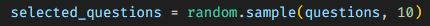

# Quiz App

## *Description*
This is a Python, Javascript, HTML and CSS quiz app. I created a bank of questions in the `questions.json` file and imported them into the `quiz.py` file. Ten randomly selected questions will be asked from the bank of questions. The user will be prompted to answer each question and will be given a score at the end of the quiz. The user can also view the correct answers to the questions they answered incorrectly.
 

***Question and answer bank was AI generated. I found 2 errors during my build process. Please excuse any inaccuracies.***
 
 

### ***Some notes about the Python json module:*** 
 - The json module allows you to encode (serialize) Python objects into JSON format and decode (deserialize) JSON data into Python objects. 
 - json.dumps() is used to convert a Python object into a JSON string representation. 
 - json.loads() is used to parse a JSON string and convert it back into a Python object. 
 - The module supports pretty printing of JSON data for better readability using the json.dumps() function with the indent parameter. 

### ***Some notes about the Python random module:*** 
 - The random module in Python provides functions for generating random numbers, selecting random elements, shuffling sequences, and other random-related operations. 
 - random.sample(list, k): Returns k unique random elements from a list (10 unique `questions` were selected in the following code snippet) 
 
 
 

## *Installation & Usage*
To install this app, simply clone the repository and run the `quiz.py` file in your terminal.
 
When prompted: 
 - Enter 1 - 4 for your choice of the answer you would like to choose. 
 

 
 

## *Questions*
<h3>Portfolio:&emsp;<a href="https://jk377y.dev" target="_blank">https://jk377y.dev</a></h3>
<h3>Email:&emsp;<a href="mailto:jk377y@gmail.com" target="_blank">jk377y@gmail.com</a></h3>
<h3>LinkedIn:&emsp;<a href="https://www.linkedin.com/in/james-kelly-software-developer/" target="_blank">https://www.linkedin.com/in/james-kelly-software-developer/</a></h3>
<h3>GitHub:&emsp;<a href="https://github.com/jk377y" target="_blank">https://github.com/jk377y</a></h3>
 
 

## *License*

 Copyright (c) 2023 James Kelly
 Information on this license can be found at: (https://opensource.org/licenses/MIT)